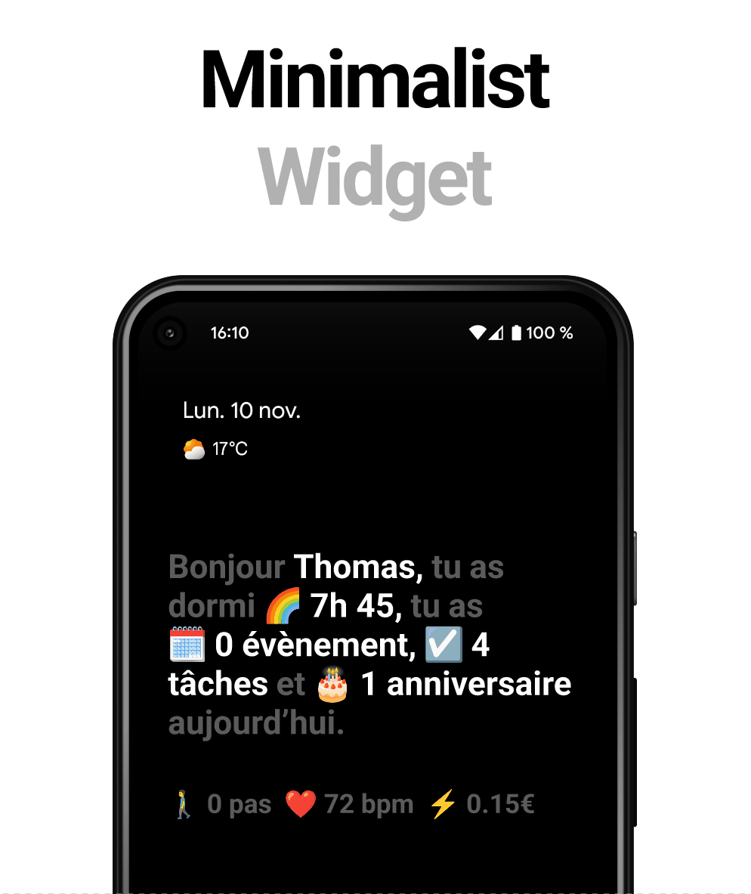

# 🌈 Home Assistant Minimalist Widget

Un widget Android minimaliste pour Home Assistant affichant votre résumé quotidien avec des messages contextuels selon l'heure de la journée.

[](https://www.home-assistant.io/)
[](LICENSE)
[](https://jinja.palletsprojects.com/)
[](https://buymeacoffee.com/votre_username)

---

## 📸 Aperçu

<!-- TODO: Ajouter vos captures d'écran ici -->


**Inspiré par [Joi Planner](https://joi.software/)** - Une visuel que j'ai voulu recréer avec mes propres données Home Assistant !

---

## ✨ Fonctionnalités

- 🌅 **Messages contextuels** - Différents messages selon l'heure (matin, après-midi, soirée, nuit)
- 😴 **Durée de sommeil** - Affichage du temps de sommeil via intégration smartphone
- 📅 **Événements restants** - Compte uniquement les événements à venir dans la journée
- ✅ **Tâches intelligentes** - Filtre automatiquement les tâches du jour (inclut retards et sans date)
- 🎂 **Anniversaires** - Détection automatique des anniversaires du jour
- 🚶‍♂️ **Statistiques quotidiennes** - Nombre de pas et consommation électrique
- 🇫🇷 **Formatage français** - Liste avec virgules et "et" avant le dernier élément
- 🎨 **Personnalisable** - Emojis, couleurs, et données entièrement configurables

## 📋 Exemples d'affichage

**Matin sans anniversaire :**
> Bonjour Thomas, tu as dormi 🌈 7h 34, tu as 📅 2 événements et ☑️ 7 tâches aujourd'hui

**Matin avec anniversaire :**
> Bonjour Thomas, tu as dormi 🌈 7h 34, tu as 📅 2 événements, ☑️ 7 tâches et 🎂 1 anniversaire aujourd'hui

**Soir :**
> Bonsoir Thomas, tu as 📅 0 événement et ✅ 0 tâche aujourd'hui
>
> 🚶‍♂️ 12 456 pas  ⚡ 3.24€

---

## 🚀 Installation rapide

### Prérequis

- Home Assistant installé
- Application Home Assistant pour Android
- Intégrations configurées :
  - 📅 Calendrier (Google Calendar, CalDAV, etc.)
  - ✅ Todo (Google Tasks, Todoist, etc.)
  - 📱 Companion App pour smartphone (sommeil, pas)

### 1. Créer les sensors

Copiez le contenu de [`config/sensors.yaml`](config/configuration_exemple.yaml) dans votre `configuration.yaml`.

**Sensors nécessaires :**
- `sensor.taches_aujourd_hui` - Compte les tâches du jour
- `sensor.events_today` - Compte les événements restants

### 2. Redémarrer Home Assistant

Redémarrez HA ou rechargez les templates :
- **Outils de développement** > **YAML** > **Recharger les entités de template**

### 3. Ajouter le widget

1. Long press sur votre écran d'accueil Android
2. Sélectionnez **Home Assistant** dans la liste des widgets
3. Choisissez **Template**
4. Copiez le contenu de [`config/widget_template.jinja2`](config/widget_template.jinja2)
5. Personnalisez les paramètres en haut du code
6. Sauvegardez !

---

## 📚 Documentation

- 📖 [Installation détaillée](docs/installation.md)
- 🎨 [Guide de personnalisation](docs/customization.md)
- 🔧 [Dépannage](docs/troubleshooting.md)
- 🚀 [Fonctionnalités avancées](docs/advanced_features.md)

---

## 🗂️ Structure du projet

```
ha-minimalist-widget/
├── README.md                       # Ce fichier
├── LICENSE                         # Licence MIT
├── CHANGELOG.md                    # Historique des versions
│
├── config/
│   ├── sensors.yaml               # Sensors template à ajouter dans HA
│   ├── widget_template.jinja2     # Code du widget Android
│   └── configuration_example.yaml # Exemple de configuration complète
│
├── docs/
│   ├── installation.md            # Guide d'installation détaillé
│   ├── customization.md           # Personnalisation avancée
│   ├── troubleshooting.md         # Résolution de problèmes
│   └── advanced_features.md       # Fonctionnalités avancées
│
└── assets/
    ├── screenshots/               # Captures d'écran du widget
    │   ├── widget_morning.png
    │   ├── widget_afternoon.png
    │   ├── widget_evening.png
    │   └── widget_night.png
    └── demo.gif                   # Animation de démonstration
```

---

## ⚙️ Personnalisation

Le widget est entièrement personnalisable ! Modifiez la section **USER PARAMETERS** :

```jinja2
        # Votre prénom
       # Couleur du texte
             # Symbole de devise

```

**Voir la [documentation de personnalisation](docs/customization.md) pour plus d'options.**

---

## 🤝 Contribution

Les contributions sont les bienvenues ! N'hésitez pas à :

- 🐛 Signaler des bugs via les [Issues](../../issues)
- 💡 Proposer des nouvelles fonctionnalités
- 🔧 Soumettre des Pull Requests
- ⭐ Mettre une étoile si ce projet vous est utile !

---

## 📝 Roadmap

Idées pour les prochaines versions :

- [ ] Affichage du prochain événement avec son heure
- [ ] Alarme/réveil pour la période nuit
- [ ] Alertes domotiques (lumières oubliées, porte ouverte, etc.)
- [ ] Intégration météo
- [ ] Support multi-langues
- [ ] Thèmes de couleurs prédéfinis

---

## 📄 Licence

Ce projet est sous licence MIT - voir le fichier [LICENSE](LICENSE) pour plus de détails.

---

## 🙏 Remerciements

- **[Joi Planner](https://play.google.com/store/apps/details?id=com.joi.planner)** - Application qui a inspiré ce projet
- **[Home Assistant](https://www.home-assistant.io/)** - La plateforme domotique open-source

---

## 💬 Support

Besoin d'aide ? Plusieurs options :

- 📖 Consultez la [documentation](docs/)
- 💬 Partagez sur le [Forum Home Assistant](https://community.home-assistant.io/)

---

## ☕ Soutenir le projet

Si ce widget vous est utile et que vous souhaitez soutenir son développement, vous pouvez m'offrir un café ! ☕

<a href="https://buymeacoffee.com/votre_username" target="_blank">
  
</a>

<a href="https://buymeacoffee.com/tben" target="_blank">
  
</a>

Chaque contribution est appréciée et aide à maintenir ce projet ! 🙏

---

<p align="center">
  Fait avec ❤️ pour la communauté Home Assistant
</p>

<p align="center">
  <a href="#-home-assistant-minimalist-widget">⬆️ Retour en haut</a>
</p>