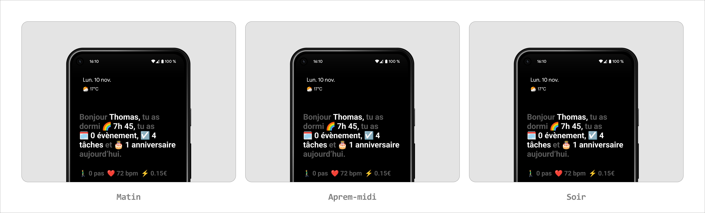
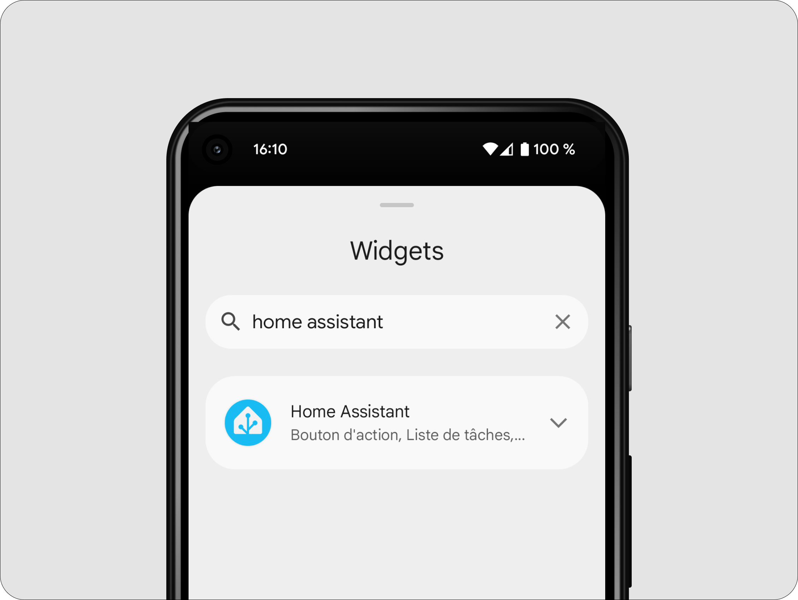
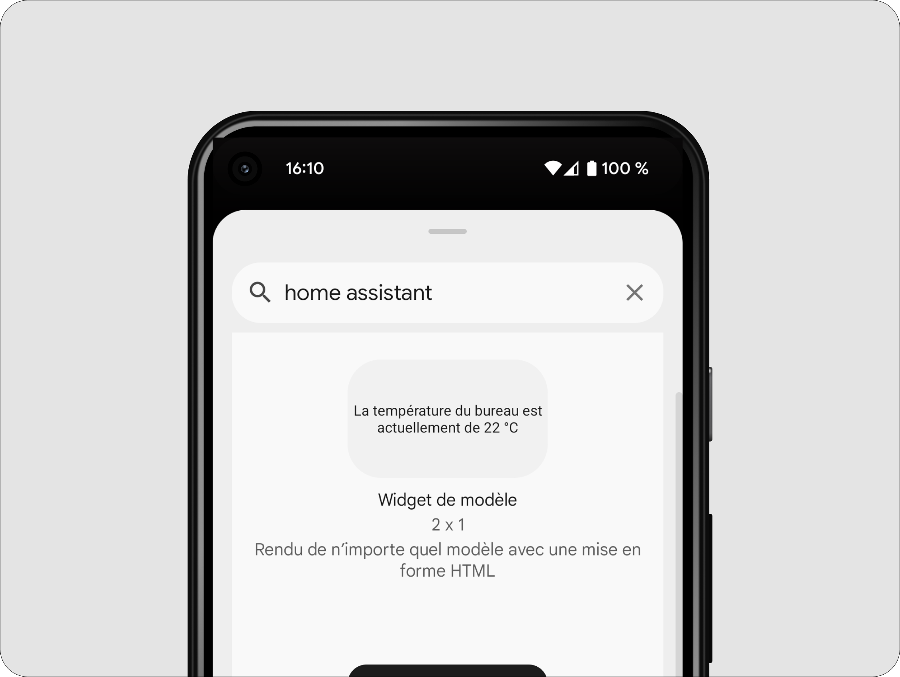
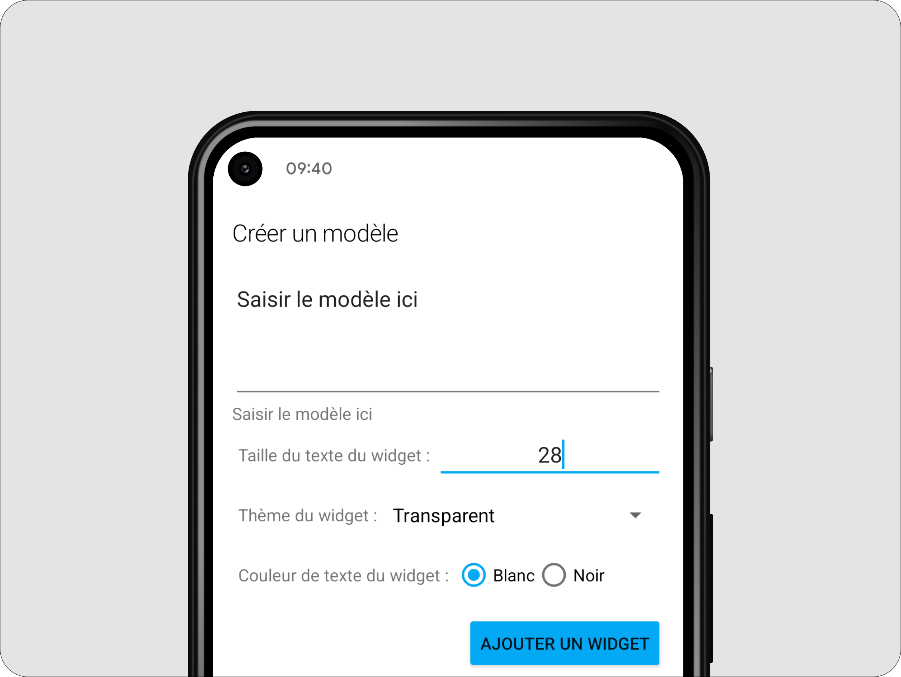
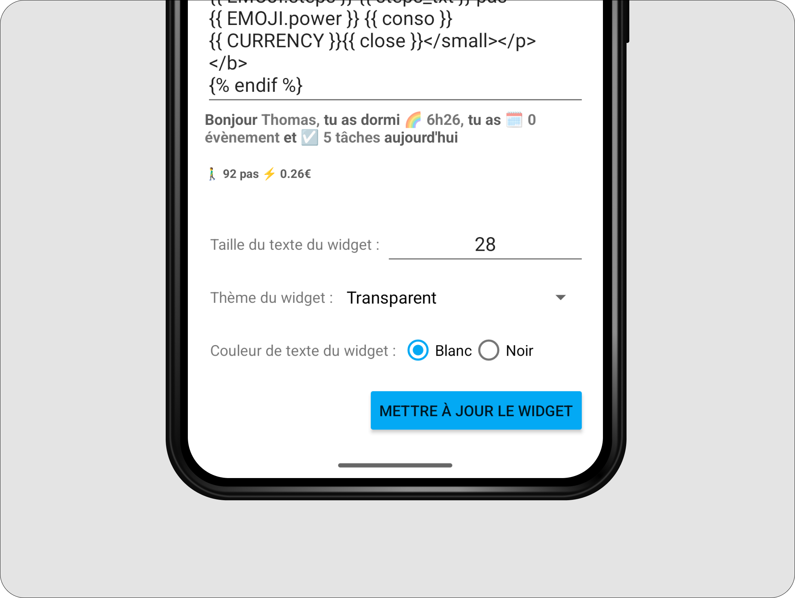

# 🌈 Home Assistant Minimalist Widget

> A minimalist Android widget for Home Assistant displaying your daily summary with contextual messages based on time of day.

[](https://www.home-assistant.io/)
[](LICENSE)
[](https://jinja.palletsprojects.com/)
[](https://buymeacoffee.com/tben)

---

## 📸 Preview


**Inspired by [Joi Planner](https://joi.software/)** - An app that I wanted to recreate with my own Home Assistant data!

---

## ✨ Features

- 🌅 **Contextual messages** - Different messages based on time of day (morning, afternoon, evening, night)
- 😴 **Sleep duration** - Display sleep time via smartphone integration
- 📅 **Remaining events** - Only counts upcoming events in the day
- ✅ **Smart tasks** - Automatically filters tasks for today (includes overdue and no-date tasks)
- 🎂 **Birthdays** - Automatic detection of today's birthdays
- 🚶‍♂️ **Daily statistics** - Step count and power consumption
- 🎨 **Customizable** - Emojis, colors, and data fully configurable

## 📋 Display Examples



---

## 🚀 Quick Installation

### Prerequisites

- Home Assistant installed
- Home Assistant app for Android
- Configured integrations:
  - 📅 Calendar (Google Calendar, CalDAV, etc.)
  - ✅ Todo (Google Tasks, Todoist, etc.)
  - 📱 Companion App for smartphone (sleep, steps)

### 1. Create sensors

Copy the content of [`config/configuration_example.yaml`](config/configuration_example.yaml) into your `configuration.yaml`.

**Required sensors:**
- `sensor.taches_aujourd_hui` - Counts tasks for today
- `sensor.events_today` - Counts remaining events

### 2. Restart Home Assistant

Restart HA or reload templates:
- **Developer Tools** > **YAML** > **Reload template entities**

### 3. Add the widget

1. Long press on your Android home screen
2. Select **Home Assistant** from the widget list



3. Choose **Template** widget



4. Configure the widget:



- Copy the content of [`config/widget_template.jinja2`](config/widget_template.jinja2)
- Customize the parameters at the top of the code
- Check the preview



5. Save!

---

## 📚 Documentation

- 📖 [Detailed installation](docs/installation.md)
- 🎨 [Customization guide](docs/customization.md)
- 🔧 [Troubleshooting](docs/troubleshooting.md)
- 🚀 [Advanced features](docs/advanced_features.md)

---

## 🗂️ Project Structure

```
ha-minimalist-widget/
├── README.md                       # This file
├── LICENSE                         # MIT License
├── CHANGELOG.md                    # Version history
│
├── config/
│   ├── configuration_example.yaml # Complete configuration for HA
│   └── widget_template.jinja2     # Android widget code
│
├── docs/
│   ├── installation.md            # Detailed installation guide
│   ├── customization.md           # Advanced customization
│   ├── troubleshooting.md         # Problem solving
│   └── advanced_features.md       # Advanced features
│
└── assets/
    ├── screenshots/               # Widget screenshots
    │   ├── widget_morning.png
    │   ├── widget_afternoon.png
    │   ├── widget_evening.png
    │   └── widget_night.png
    └── demo.gif                   # Demo animation
```

---

## ⚙️ Customization

The widget is fully customizable! Modify the **USER PARAMETERS** section:

```jinja2
        # Your first name
       # Text color
             # Currency symbol

```

**See the [customization documentation](docs/customization.md) for more options.**

---

## ☕ Support the Project

If this widget is useful to you and you want to support its development, you can buy me a coffee! ☕

<a href="https://buymeacoffee.com/tben" target="_blank">
  
</a>

Every contribution is appreciated and helps maintain this project! 🙏

---

<p align="center">
  Made with ❤️ for the Home Assistant community
</p>

<p align="center">
  <a href="#-home-assistant-minimalist-widget">⬆️ Back to top</a>
</p>